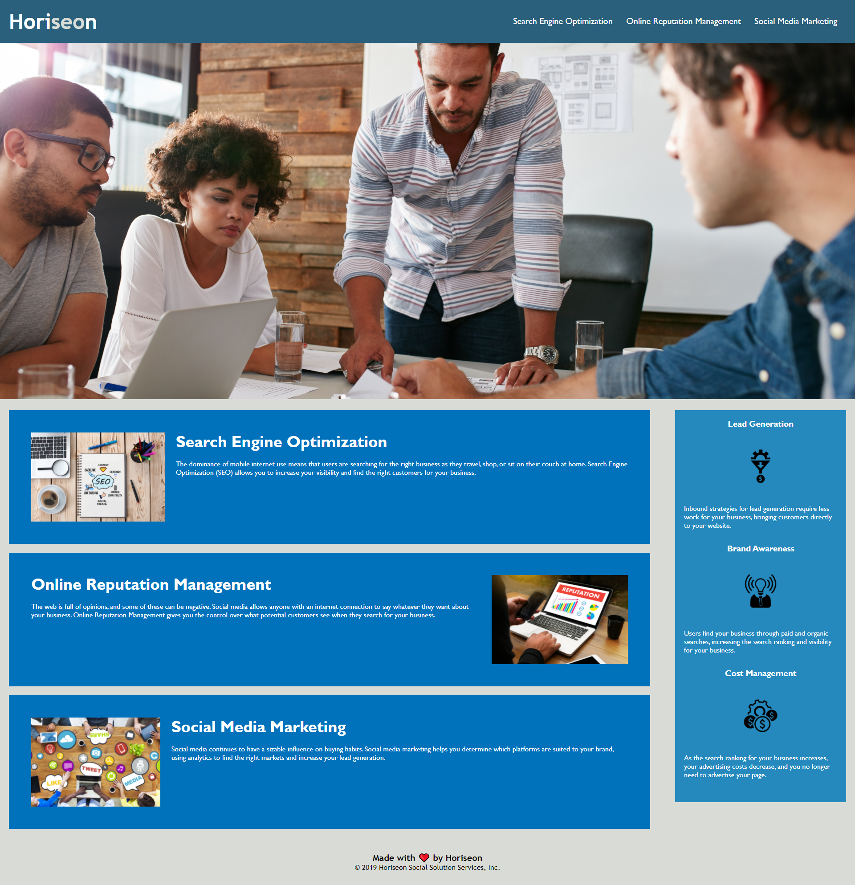

# HoriseonSEO
##  Horiseon SEO & Marketing Website
Horiseon SEO wanted a codebase that followed accessibility standards, so that their own website would be optimized for search engines.
- What was your motivation?
```
My motivation for this project was to gain a better understanding of accessibility standards and sementic elements.
```
- Why did you build this project?
```
After looking at the original code I could see there were no semantic elements being used, which made it very hard to understand and read. 
```
- What problem does it solve?
```
Added semantic elements instead of using <div> tags allows accessibility and readability. Doing this allows future developers to easily understand what is happening. 
```
- What did you learn?
```
I learned proper placement for sementic elements. I learned about using different types of selectors
```
## Demo
[DEMO LINK](https://bdubz93.github.io/HoriseonSEO/) 
## Installation
- Click the green code button on GitHub
- Select clone, GitHub Desktop, or download ZIP
- Open downloaded folder and open index.html
## Usage
- A base website layout
- Learning material
- Reference sheet for HTML and CSS elements



## Credits
- https://www.w3schools.com/cssref/css_selectors.asp
- https://www.w3schools.com/html/html5_semantic_elements.asp
- https://coding-boot-camp.github.io/full-stack/github/professional-readme-guide
- https://coding-boot-camp.github.io/full-stack/html/html-cheatsheet
## License
- [APACHE 2.0 LICENSE](license)
---